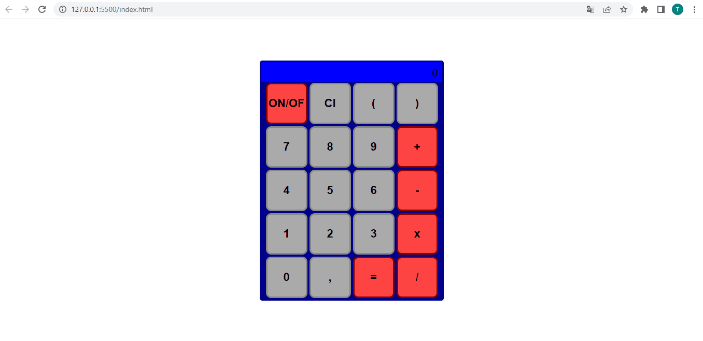

# Calculadora
Page de uma calculadora básica com a possibilidade de quatro operações (adição, subtração, multiplicação e divisão). Para a realização dessas operações eu utilizei a função eval() que recebe o parâmetro e faz todo o cálculo.

## Tecnologias utilizadas: 
 - HTML;
 - CSS;
 - JAVASCRIPT.